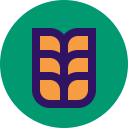

# TSECHackathon

## Problem Statement
Implement a Web Based solution through which farmers can participate in a commodity exchange market. The solution should explain the process involved and the benefits of commodity exchange to the user.
The purpose of such an exchange is to provide a centralized marketplace where commodity producers can sell their commodities to those who want to use them for manufacturing or consumption.
The solution should enable farmers to create independent accounts and interact with dealers to avail the best profits and deals.

## Tech Stack
- Pure HTML5, CSS3 and JavaScript for the frontend.
- Node.js + Express.js for endpoints and serving static files.
- MongoDB for the database.

## Logo

## Landing page flow
- Unified landing page loads.
- Do GET /user
	- if successful, go to respective dashboard.
- Wait for user to enter valid phone, and press next.
- Do POST /otp {phone_number}
	- if post is unsuccessful, then we have bigger problems.
- (*) Wait for user to enter valid OTP, and press next.
- Do POST /authenticate {phone_number, otp}
	- if post is successful, do GET /user
		- if successful then user exists, go to respective dashboard.
		- else user does not exist, goto signup.
- Inform user that OTP is wrong, goto (*)

## Api Documentation

## Local Setup
- Clone repository.
- Setup MongoDB, either locally, in a Docker container or on the cloud.
- Edit the MongoDB server Url in `/server/server.js`.
- Run `npm install` and `npm start` in the `/server` folder.
- Go to `https://localhost:5000` in your web browser.